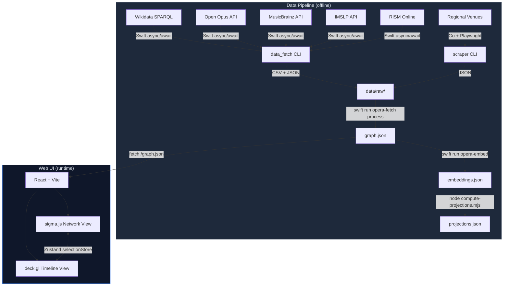
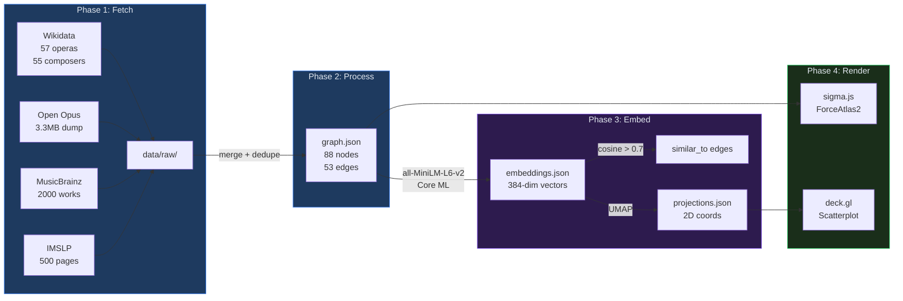
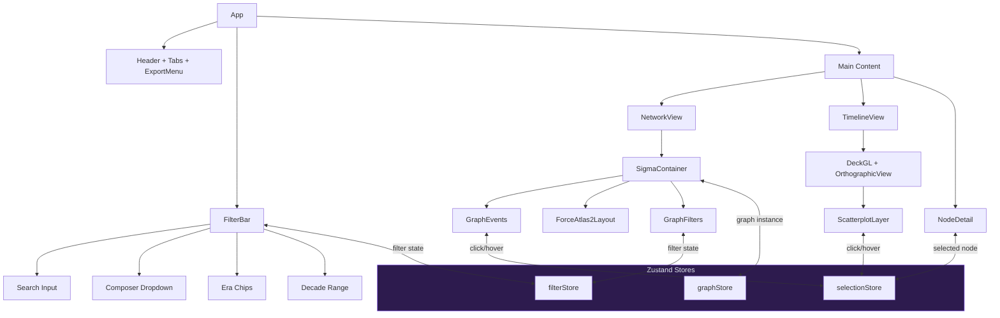
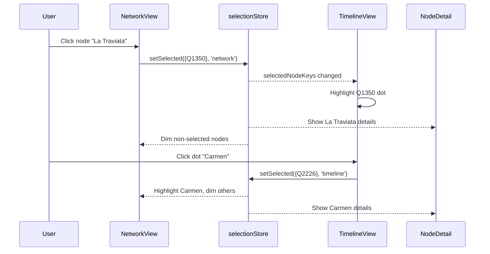
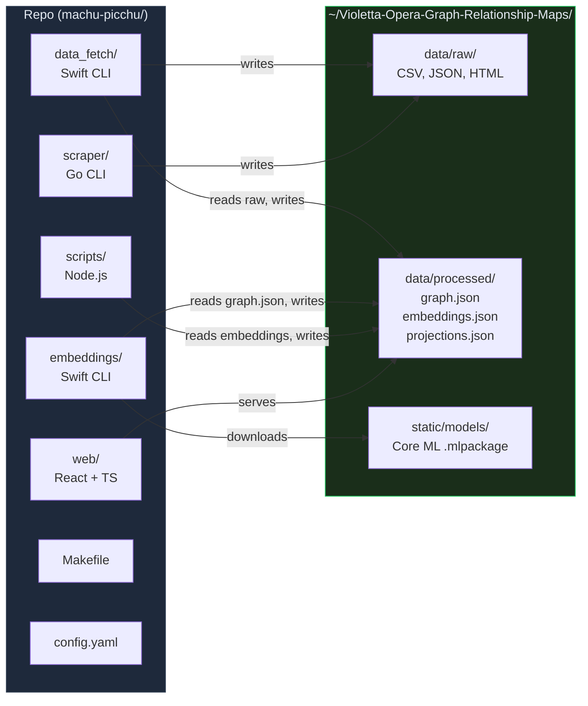
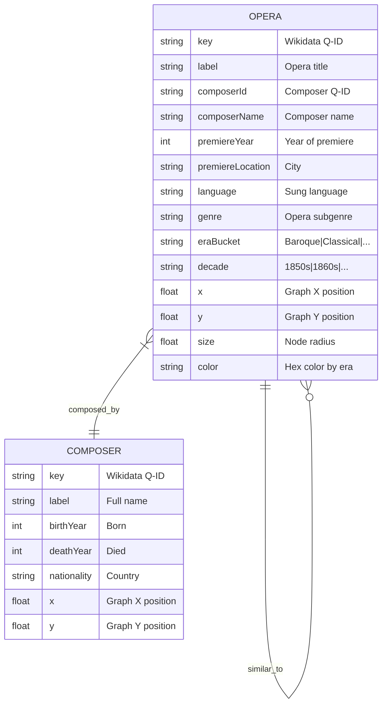
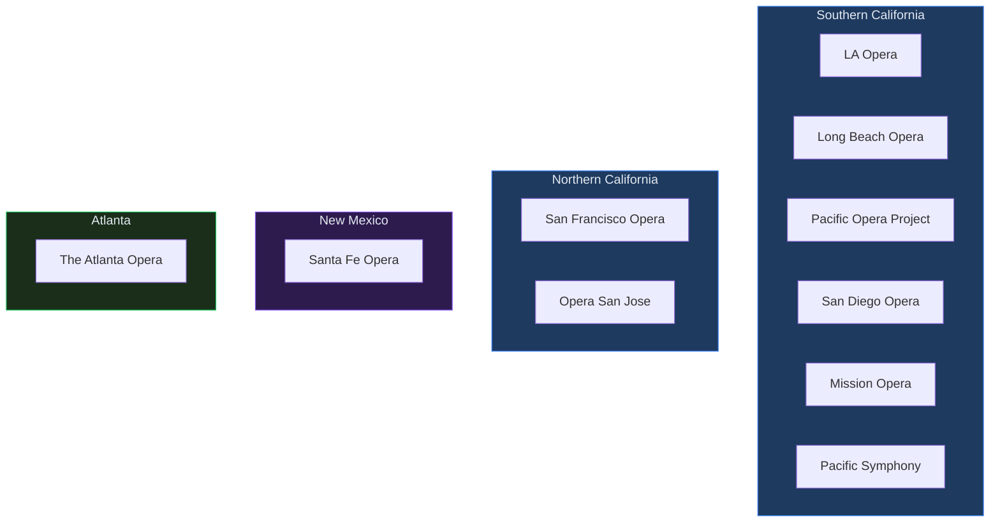
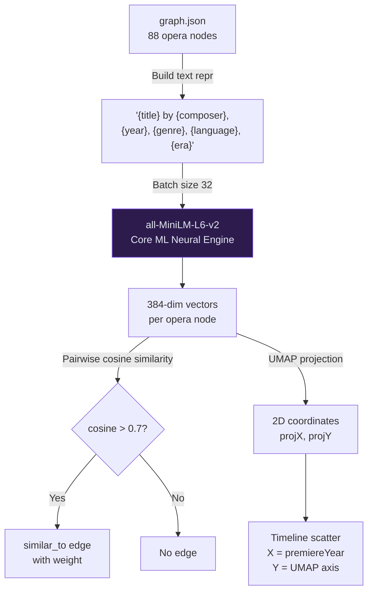
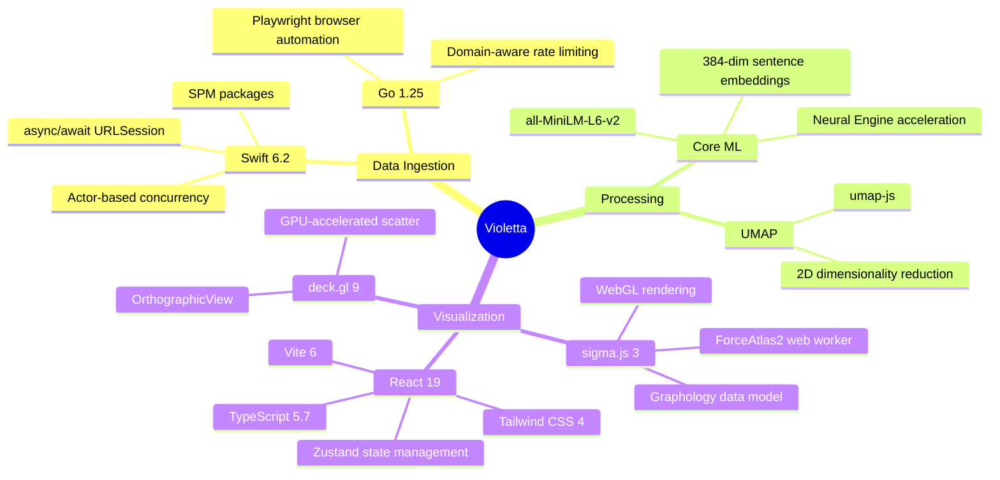

# Violetta Opera Graph Relationship Maps

[](https://blueoakcouncil.org/license/1.0.0)
[](https://swift.org)
[](https://go.dev)
[](https://typescriptlang.org)
[](https://react.dev)
[](https://vite.dev)
[](https://developer.apple.com/macos/)
[](https://support.apple.com/en-us/116943)
[](https://sigmajs.org)
[](https://deck.gl)
[](https://developer.apple.com/documentation/coreml)

Interactive, GPU-accelerated visualization of opera relationships: composers, works, premieres, librettists, and regional performances. Two linked WebGL views let you explore the opera world as a force-directed network graph and a chronological timeline scatter.

---

## System Architecture



## Data Flow



## Web UI Component Tree



## Linked Selection Protocol



## Repository Structure



## Era Color Encoding

| Era | Years | Color | Hex |
|-----|-------|-------|-----|
| Baroque | < 1750 |  | `#8B5CF6` |
| Classical | 1750 - 1820 |  | `#06B6D4` |
| Early Romantic | 1820 - 1850 |  | `#22C55E` |
| Late Romantic | 1850 - 1910 |  | `#EAB308` |
| 20th Century | 1910 - 1975 |  | `#F97316` |
| Contemporary | > 1975 |  | `#EF4444` |

Composer nodes use `#60A5FA` (blue). Node size encodes degree centrality (number of connections).

---

## Prerequisites

| Tool | Version | Install |
|------|---------|---------|
| macOS | 15+ (Sequoia) | -- |
| Xcode | 26+ | Mac App Store |
| Swift | 6.2+ | Included with Xcode |
| Go | 1.25+ | `brew install go` |
| Node.js | 20+ | `brew install node` |
| GNU Make | 3.81+ | Included with Xcode CLT |

## Quick Start

```bash
# Clone and enter the repo
git clone <repo-url> && cd machu-picchu

# Install all dependencies (Swift, Go, Node)
make setup

# Pull opera data from live APIs
make fetch

# Start the interactive web UI
make dev
# --> http://localhost:5173
```

Or run the full pipeline including embeddings:

```bash
make all    # setup -> fetch -> embed -> build
```

## Makefile Targets

| Target | Description |
|--------|-------------|
| `make setup` | Install all dependencies (Swift build, Go modules, npm install) |
| `make fetch` | Pull data from all APIs + scrape regional venues |
| `make embed` | Generate Core ML sentence embeddings + UMAP 2D projections |
| `make build` | Build web UI for production (`web/dist/`) |
| `make dev` | Start Vite dev server at `localhost:5173` |
| `make all` | Full pipeline: setup -> fetch -> embed -> build |
| `make process` | Re-process raw data into `graph.json` (no re-fetching) |
| `make scrape-socal` | Scrape Southern California venues only |
| `make scrape-norcal` | Scrape Northern California venues only |
| `make scrape-nm` | Scrape New Mexico venues only |
| `make scrape-atl` | Scrape Atlanta venues only |
| `make scrape-regional-all` | Scrape all regional venues |
| `make clean` | Remove build artifacts (preserves fetched data) |

## Data Sources

| Source | Type | Rate Limit | Data |
|--------|------|------------|------|
| [Wikidata](https://query.wikidata.org/) | SPARQL | 2 req/s | Opera metadata, composers, relationships |
| [Open Opus](https://openopus.org) | REST JSON | 5 req/s | Composer bios, work catalogs |
| [MusicBrainz](https://musicbrainz.org) | REST JSON | 1 req/s | Work hierarchy, recordings, releases |
| [IMSLP](https://imslp.org) | MediaWiki API | 1 req/s | Score metadata, publication dates |
| [RISM Online](https://rism.online) | REST JSON | 2 req/s | Historical music source records |
| Regional Venues | HTML Scraping | Configurable | Upcoming performances by venue |

## Graph Schema



## Regional Venue Coverage



## Embedding Pipeline



## Configuration

All scraping limits, rate limits, and regional venue configs live in [`config.yaml`](config.yaml).

See [`STATIC_FILES.md`](STATIC_FILES.md) for the full data directory layout at `~/Violetta-Opera-Graph-Relationship-Maps/`.

## Adding Regional Venues

1. Edit `config.yaml` and add a new venue under the appropriate region
2. Run `make scrape-regional-all` to scrape all venues

```yaml
- name: "Your Opera Company"
  code: "youropera"
  official_url: "https://www.youropera.org"
  calendar_url: "https://www.youropera.org/events"
  city: "Your City"
  state: "ST"
```

## Exports

The web UI supports three export formats from the header menu:

| Format | Description |
|--------|-------------|
| **PNG** | Rasterized screenshot of the current sigma.js canvas |
| **SVG** | Vector graphic generated from node/edge positions |
| **JSON** | Raw `graph.json` download (Graphology format) |

## Tech Stack



## License

[Blue Oak Model License 1.0.0](https://blueoakcouncil.org/license/1.0.0)
