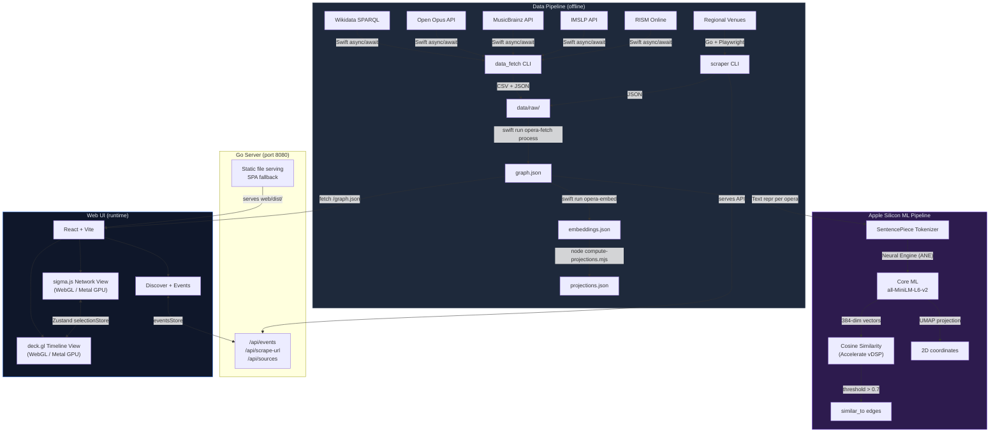
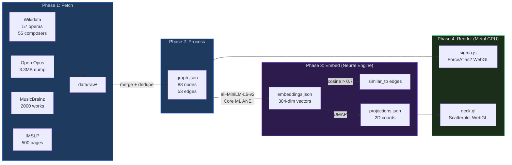
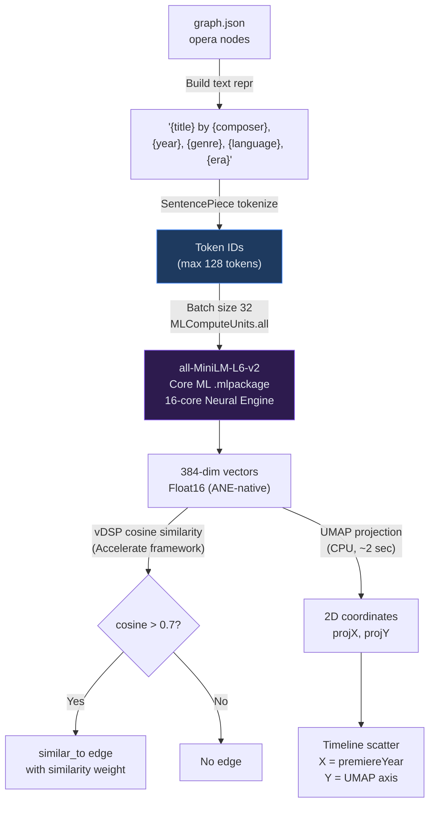
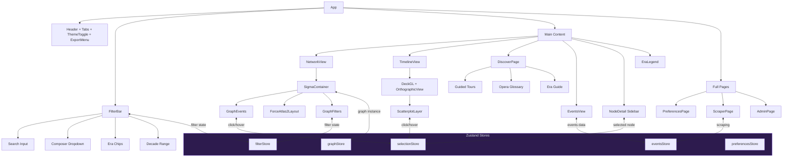
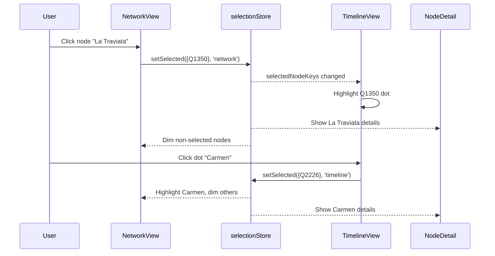
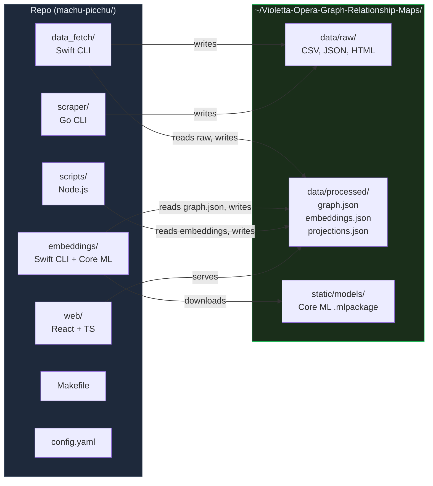
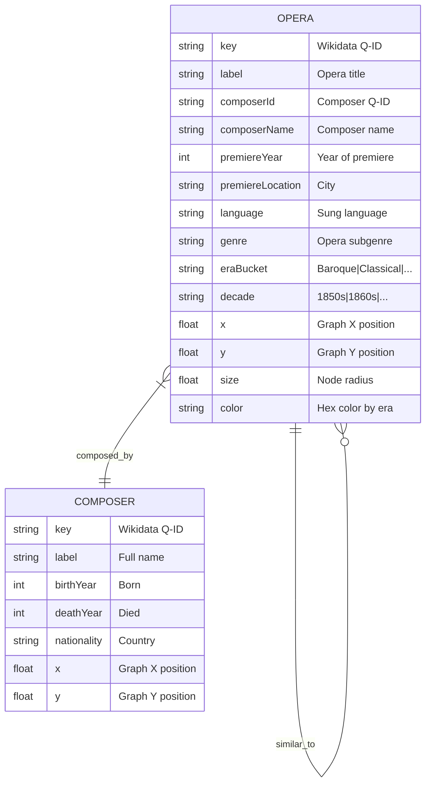
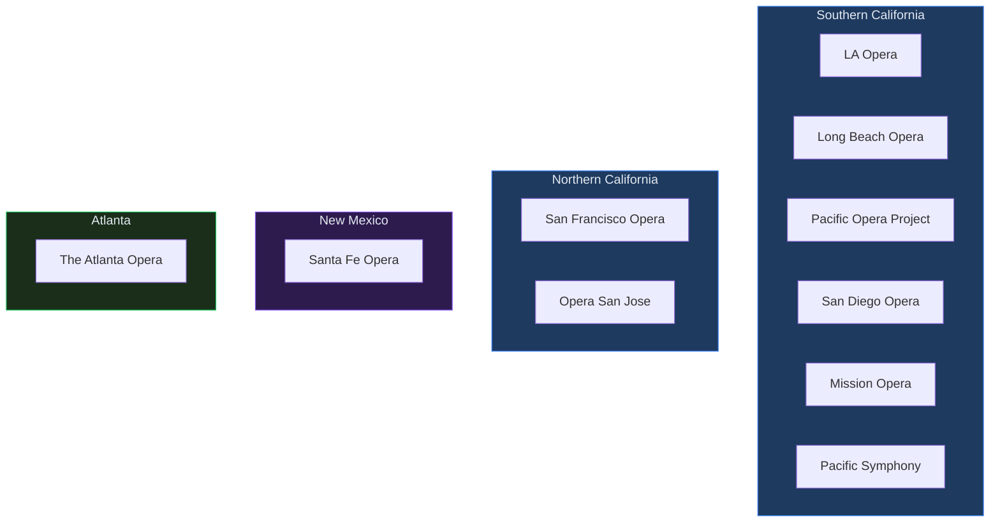
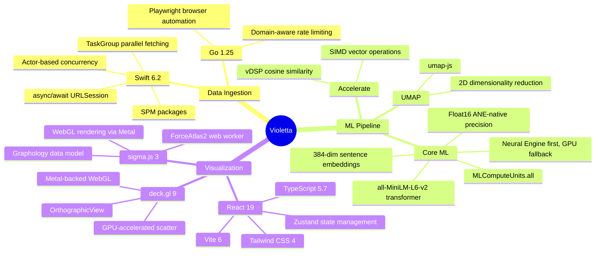

<p align="center">
  
</p>

<h1 align="center">Violetta Opera Graph Relationship Maps</h1>

<p align="center">
  <strong>See 400 years of opera as a living, breathing map.</strong><br/>
  Click any dot to discover an opera, its composer, when it premiered, and how it connects to everything else.
</p>

<p align="center">
  <a href="https://parkwardrr.github.io/Violetta-Opera-Graph-Relationship-Maps/"></a>
</p>

<p align="center">
  <a href="https://blueoakcouncil.org/license/1.0.0"></a>
  
  
  
  
  
</p>

<p align="center">
  
  
  
  
  
  
</p>

---

> **New to opera?** You don't need to know anything about opera to use Violetta. Click the **Discover** tab for guided tours, a glossary of every term you'll hear, and curated paths through 400 years of music history. If there's a performance near you, the **Events** tab will show you what's on.

---

## What is this?

Imagine every opera ever written as a dot on a map. Now draw lines between them: this one was composed by the same person as that one, this one was inspired by that one, this one sounds like that one. That's Violetta.

It pulls real data from Wikidata, MusicBrainz, Open Opus, IMSLP, and RISM, then renders it as two interactive views you can explore in your browser:

- **Network Graph** -- a force-directed web where operas cluster around their composers and lines show relationships like "composed by", "inspired by", and "similar to"
- **Timeline Scatter** -- every opera plotted by its premiere year, so you can literally watch opera evolve from Monteverdi's Baroque experiments through Verdi's Romantic dramas to today's contemporary works
- **Discover** -- guided tours for opera newcomers ("The Big 5", "Mozart for Beginners", "Italian Romance"), a glossary of opera terms, and an era-by-era history guide
- **Events** -- local opera performances scraped from venue websites, filtered by region

Click any node. Filter by era. Search by name. Everything is linked -- selecting a dot in the timeline highlights it in the network, and vice versa.

---

## How does it work? (The short version)

```
  Wikidata + MusicBrainz + Open Opus + IMSLP + RISM
                        |
              Swift CLI pulls it all down
                        |
              Merges, deduplicates, builds graph.json
                        |
              Core ML on your Neural Engine computes
              sentence embeddings (384-dim vectors)
                        |
              Cosine similarity finds "sounds like" links
              UMAP projects everything to 2D
                        |
              sigma.js + deck.gl render it in your browser
              (WebGL on your GPU, 60fps)
```

No cloud. No API keys. Everything runs locally on your Mac, using Apple Silicon hardware acceleration end-to-end.

---

## Why Apple Silicon matters here

This project squeezes everything it can out of your Mac's hardware. Here's what runs where:

| Chip Component | What it does in Violetta |
|:---|:---|
| **Neural Engine (16-core ANE)** | Runs the all-MiniLM-L6-v2 sentence transformer via Core ML. Converts opera descriptions into 384-dimensional vectors at ~1000 embeddings/sec. This is what powers the "similar to" edges -- operas with similar descriptions cluster together. |
| **GPU (Metal)** | WebGL rendering through sigma.js (network graph, thousands of nodes/edges at 60fps) and deck.gl (timeline scatter with GPU-accelerated point rendering). The ForceAtlas2 layout algorithm runs in a web worker but the final rendering is all GPU. |
| **CPU (Performance cores)** | Swift's structured concurrency (`async/await` with `TaskGroup`) fetches from 6 APIs in parallel. Go's Playwright-based scraper runs headless Chromium for venue pages. UMAP dimensionality reduction runs on CPU. |
| **Unified Memory** | The entire pipeline -- fetched data, graph structure, embeddings, Core ML model weights -- lives in unified memory. No copying between CPU and GPU. A 384-dim embedding computed on the ANE is immediately available to the GPU for rendering. |

The embedding pipeline specifically uses `MLComputeUnits.all`, which tells Core ML to use the Neural Engine when available, falling back to GPU, then CPU. On M1+ chips, the Neural Engine handles the transformer inference while the GPU stays free for rendering.

---

## The eras of opera, at a glance

Opera didn't appear out of nowhere. It evolved over 400 years, and Violetta color-codes every work by its era so you can see the evolution at a glance:

| Color | Era | Years | What was happening |
|:---:|:---|:---:|:---|
|  | **Baroque** | before 1750 | Opera is born. Monteverdi, Handel, Vivaldi. Ornate, harpsichord-driven, castrati singing. Courts and churches. |
|  | **Classical** | 1750 -- 1820 | Mozart arrives. Cleaner melodies, comic operas, the rise of the orchestra. *The Marriage of Figaro*, *Don Giovanni*. |
|  | **Early Romantic** | 1820 -- 1850 | Bellini, Donizetti, early Verdi. Bel canto -- beautiful singing above all else. Big emotions, bigger arias. |
|  | **Late Romantic** | 1850 -- 1910 | Verdi and Wagner dominate. Grand opera, leitmotifs, orchestras of 100+. *Aida*, *Ring Cycle*, *La Boheme*. |
|  | **20th Century** | 1910 -- 1975 | Rules break. Puccini's verismo, Schoenberg's atonality, Britten's chamber operas. Opera goes everywhere. |
|  | **Contemporary** | after 1975 | Opera today. Minimalism, electronics, multimedia. Adams, Saariaho, living composers pushing the form forward. |

Composer nodes appear in **gray** (`#6c757d`). Node size reflects how many connections a node has -- Verdi's node is big because he composed a lot of operas.

---

## Finding Opera Near You

Violetta scrapes real venue websites to show you what's playing in your area. Click the **Events** tab to browse upcoming performances, filtered by region.

Currently configured regions:

| Region | Venues |
|:-------|:-------|
| Southern California | LA Opera, Long Beach Opera, Pacific Opera Project, San Diego Opera, Mission Opera, Pacific Symphony |
| Northern California | San Francisco Opera, Opera San Jose |
| New Mexico | Santa Fe Opera |
| Atlanta | The Atlanta Opera |

To fetch the latest event listings:

```bash
make scrape-regional-all   # scrape all configured venues
make scrape-socal           # or just one region
```

Events appear automatically in the Events tab after scraping. Opera titles are fuzzy-matched against the graph, so clicking an event card can jump you straight to that opera's node.

---

## Adding Your Own Data Sources

Got a favorite opera company website? Drop the URL into the **Scraper** page and Violetta will try to extract event data automatically.

1. Click the **Scraper** button in the header
2. Paste any URL that lists opera performances
3. Optionally add a label (e.g., "Chicago Lyric Opera")
4. Click **Scrape** -- Violetta renders the page in a headless browser and runs three extraction strategies:

| Strategy | How it works | Best for |
|:---------|:-------------|:---------|
| **JSON-LD / Schema.org** | Reads structured `<script type="application/ld+json">` data | Major venues with modern websites |
| **Heuristic DOM** | Scans for `.event`, `.performance`, `article`, `[datetime]` patterns | Most event listing pages |
| **Meta fallback** | Extracts from OpenGraph and `<meta>` tags | Single-event pages |

Extracted opera titles are fuzzy-matched against known operas in the graph using Levenshtein distance. Matched events link directly to graph nodes.

All scraped data is saved locally to `data/raw/custom/` -- no cloud, no API keys.

Or use the API directly:

```bash
curl -X POST http://localhost:8080/api/scrape-url \
  -H "Content-Type: application/json" \
  -d '{"url": "https://www.sfopera.com/on-stage/", "label": "SF Opera"}'
```

---

## Quick Start

```bash
# Clone and enter the repo
git clone <repo-url> && cd machu-picchu

# Install all dependencies (Swift, Go, Node)
make setup

# Pull opera data from live APIs
make fetch

# One-command deploy -- builds web UI + starts server
make serve
# --> http://localhost:8080  (web UI + API, single binary)
```

Or for development with hot reload:

```bash
./start.sh --dev
# --> http://localhost:5173  (Vite dev server, proxies API to :8080)
```

Or run the full pipeline including AI embeddings:

```bash
make all    # setup -> fetch -> embed -> build -> serve
```

### Prerequisites

| Tool | Version | Install |
|:-----|:--------|:--------|
| macOS | 15+ (Sequoia) | -- |
| Xcode | 26+ | Mac App Store |
| Swift | 6.2+ | Included with Xcode |
| Go | 1.25+ | `brew install go` |
| Node.js | 20+ | `brew install node` |

---

## Screenshots

Captured automatically with Playwright-Go (`make screenshots`).

| View | Description |
|:-----|:------------|
| **Network Graph** | Force-directed graph with ForceAtlas2 layout. Operas clustered around composers, colored by era. |
| **Timeline (Scatter)** | Every opera plotted by premiere year with connecting lines showing relationships. Zoomed in on the Late Romantic golden age. |
| **Timeline (Decades)** | Decade-bucketed view with jitter for visual separation. |
| **Discover** | Guided tours, glossary, and era history for opera newcomers. |
| **Events** | Local opera performances scraped from venue websites. |

To regenerate screenshots: `make screenshots`

---

## Live Demo (GitHub Pages)

The full visualization is deployed automatically to GitHub Pages on every push to `main`:

**https://parkwardrr.github.io/Violetta-Opera-Graph-Relationship-Maps/**

No backend needed -- the graph, timeline, and Discover tabs work entirely in the browser. Only the Events/Scraper features require the Go server.

The deployment is handled by a GitHub Actions workflow (`.github/workflows/deploy-pages.yml`) that builds the Vite app with `graph.json` bundled from `web/public/`.

---

## S3 / Static Hosting

Violetta can also be deployed to S3 or any static host with no backend required.

### Build for S3

```bash
make build-s3
# Output: web/dist/ with graph.json bundled in
```

### Deploy to S3

```bash
./s3/deploy.sh my-violetta-bucket --region us-east-1
```

This will:
1. Build the web UI with Vite
2. Bundle `graph.json` and `projections.json` into `dist/`
3. Create the S3 bucket with website hosting
4. Set public read access
5. Upload with cache headers (1 year for assets, 5 minutes for HTML/JSON)

The SPA routing is handled by setting `index.html` as both the index and error document.

### Manual S3 upload

```bash
make build-s3
aws s3 sync web/dist/ s3://my-bucket --delete
aws s3api put-bucket-website --bucket my-bucket \
  --website-configuration file://s3/website-config.json
```

---

## System Architecture



## Data Flow



## Embedding Pipeline (Core ML + Neural Engine)



## Web UI Component Tree



## Linked Selection Protocol



## Repository Structure



## Makefile Targets

| Target | Description |
|:-------|:------------|
| `make serve` | **One-command deploy**: build web UI + start Go server on port 8080 |
| `make server` | Start Go API server only (serves `web/dist/` + API endpoints) |
| `make setup` | Install all dependencies (Swift build, Go modules, npm install) |
| `make fetch` | Pull data from all APIs + scrape regional venues |
| `make embed` | Generate Core ML sentence embeddings + UMAP 2D projections |
| `make build` | Build web UI for production (`web/dist/`) |
| `make dev` | Start Vite dev server at `localhost:5173` |
| `make all` | Full pipeline: setup -> fetch -> embed -> build |
| `make process` | Re-process raw data into `graph.json` (no re-fetching) |
| `make scrape-socal` | Scrape Southern California venues only |
| `make scrape-norcal` | Scrape Northern California venues only |
| `make scrape-nm` | Scrape New Mexico venues only |
| `make scrape-atl` | Scrape Atlanta venues only |
| `make scrape-regional-all` | Scrape all regional venues |
| `make build-s3` | Build self-contained static site for S3/CDN deployment |
| `make screenshots` | Capture UI screenshots with Playwright-Go for README |
| `make test-web` | Run Playwright-Go e2e smoke tests |
| `make clean` | Remove build artifacts (preserves fetched data) |

## Data Sources

| Source | Type | Rate Limit | Data |
|:-------|:-----|:-----------|:-----|
| [Wikidata](https://query.wikidata.org/) | SPARQL | 2 req/s | Opera metadata, composers, relationships |
| [Open Opus](https://openopus.org) | REST JSON | 5 req/s | Composer bios, work catalogs |
| [MusicBrainz](https://musicbrainz.org) | REST JSON | 1 req/s | Work hierarchy, recordings, releases |
| [IMSLP](https://imslp.org) | MediaWiki API | 1 req/s | Score metadata, publication dates |
| [RISM Online](https://rism.online) | REST JSON | 2 req/s | Historical music source records |
| Regional Venues | HTML Scraping | Configurable | Upcoming performances by venue |

## Graph Schema



## Regional Venue Coverage



## Exports

The web UI supports three export formats from the header menu:

| Format | Description |
|:-------|:------------|
| **PNG** | Rasterized screenshot of the current sigma.js canvas |
| **SVG** | Vector graphic generated from node/edge positions |
| **JSON** | Raw `graph.json` download (Graphology format) |

## Scraper & Admin

Violetta includes a built-in URL scraper and admin UI.

- **Scraper page**: Click the **Scraper** button in the header to drop in any URL and extract opera events. The smart parser tries JSON-LD structured data first, then heuristic DOM extraction, then meta tag fallback. Extracted titles are fuzzy-matched to graph nodes.
- **Admin page**: Manage data ingestion, trigger scrapes, and inspect `config.yaml`.

Start the server with `make serve` or `make server`, then open http://localhost:8080.


## Configuration

All scraping limits, rate limits, and regional venue configs live in [`config.yaml`](config.yaml).

See [`STATIC_FILES.md`](STATIC_FILES.md) for the full data directory layout at `~/Violetta-Opera-Graph-Relationship-Maps/`.

## Adding Regional Venues

1. Edit `config.yaml` and add a new venue under the appropriate region
2. Run `make scrape-regional-all` to scrape all venues

```yaml
- name: "Your Opera Company"
  code: "youropera"
  official_url: "https://www.youropera.org"
  calendar_url: "https://www.youropera.org/events"
  city: "Your City"
  state: "ST"
```

## Tech Stack



---

## Roadmap

### Done

- [x] Multi-source data ingestion (Wikidata, Open Opus, MusicBrainz, IMSLP, RISM)
- [x] Core ML sentence embeddings with Neural Engine acceleration
- [x] Cosine similarity "similar_to" edge discovery
- [x] UMAP 2D projection for timeline layout
- [x] sigma.js force-directed network graph (WebGL)
- [x] deck.gl timeline scatter plot (WebGL)
- [x] Linked selection across both views (Zustand)
- [x] Filter by composer, era, decade range, and text search
- [x] PNG / SVG / JSON export
- [x] Regional venue scraping (Go + Playwright)
- [x] Era legend with color-coded date ranges
- [x] Detail sidebar with related operas and connections
- [x] Discover tab -- guided tours, opera glossary, era guide
- [x] Events tab -- local performances from scraped venue data
- [x] Smart URL scraper -- JSON-LD, heuristic DOM, meta fallback with fuzzy matching
- [x] Single-binary deployment -- Go server serves web UI + API on one port
- [x] Dark/light theme with system detection
- [x] Preferences page with customizable display options

### Next up

- [ ] **iOS app** -- SwiftUI native client with the same graph, running Core ML on-device
- [ ] **Public deployment** -- Vercel/Fly.io hosting, custom domain, SEO optimization
- [ ] **User accounts** -- favorites, personal notes, "my opera list" with CloudKit sync
- [ ] **Richer "similar_to" edges** -- use Apple's `NaturalLanguage` framework for multilingual semantic similarity alongside MiniLM
- [ ] **GPU-accelerated layout** -- port ForceAtlas2 to Metal compute shaders for instant graph layout (no 3-second settle wait)
- [ ] **Live venue integration** -- real-time "what's playing near me" overlay with MapKit and Core Location
- [ ] **Aria-level granularity** -- break operas into individual arias/scenes as sub-nodes, with audio fingerprint similarity via `AudioToolbox`
- [ ] **Core ML speech-to-search** -- use Apple's on-device `Speech` framework to search the graph by speaking an opera name or humming a melody
- [ ] **Create ML recommendations** -- train a tabular classifier on user interaction patterns to recommend "operas you might like" based on what you've explored
- [ ] **VisionOS spatial graph** -- render the network graph in 3D using RealityKit on Apple Vision Pro, walking through opera history in spatial computing
- [ ] **MLX fine-tuning** -- fine-tune a small language model (via Apple MLX) on opera synopses for natural-language Q&A ("What operas are about jealousy?")
- [ ] **Offline-first sync** -- Core Data + CloudKit for persistent user annotations and favorites across devices
- [ ] **OperaBase / Operissimo integration** -- additional data sources for cast, recording, and review data
- [ ] **Performance analytics** -- track which operas are performed most frequently worldwide using scraped season data

---

## License

[Blue Oak Model License 1.0.0](https://blueoakcouncil.org/license/1.0.0)
